<h1 align="left">🤵🏻 Sobre mim:</h1>

###

Olá! Meu nome é Marcos e sou estudante de Análise e Desenvolvimento de Sistemas na UNIASSELVI. Atualmente, também estou aprofundando meus conhecimentos por meio de um curso de Desenvolvimento Full Stack. Tenho interesse e paixão por tecnologia, especialmente pelo desenvolvimento web, e estou constantemente aprimorando minhas habilidades por meio de estudos e projetos práticos. Busco evoluir continuamente como desenvolvedor e construir soluções cada vez mais eficientes e relevantes.

###

  
  
  
  
  

###

  

###

<h3 align="left">🤖 Linguagens e Tecnologias:</h3>

###

  
  
  
  
  
  
  
  
  
  
  
  
  
  
  

###

<h3 align="left">📊  Estatísticas:</h3>

###

  
  

###
